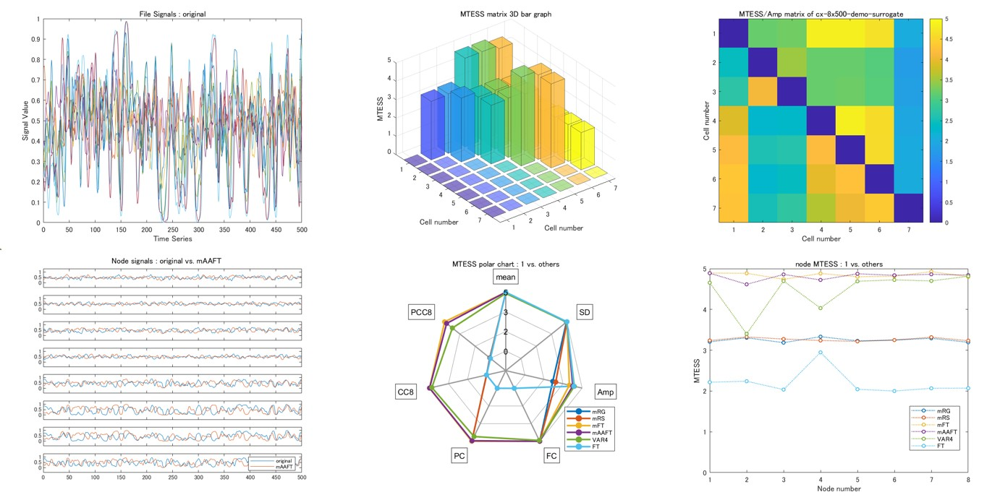

# MTESS and GSDGM toolbox
Multivariate Time-series Ensemble Similarity Score (MTESS) and Group Surrogate Data Generating Model (GSDGM) toolbox

## Introduction
MTESS and GSDGM toolbox is a powerful tool for multivariate time-series similarity analysis and data generating model.

## Requirements: software
* MATLAB R2019b or later
* Deep Learning Toolbox ver12.1 or later
* Fuzzy Logic Toolbox ver2.6 or later
* Parallel Computing Toolbox ver7.1 or later
* [VARDNN Toolbox](https://github.com/takuto-okuno-riken/vardnn)

## Command line tool
~~~
>> mtess -h
usage: mtess [options] file1.csv file2.csv ...
  --range n1:n2       value range [n1, n2] for normalized mean and std dev (default:min and max of input data)
  --ndft num          DFT sampling <number> (even number) (default: 100)
  --pcc type          Partial Cross-Correlation algorithm 0:auto, 1:PCC, 2:SV-PCC (dafault:0)
  --cclag num         time lag <num> for Cross Correlation (default:8)
  --pcclag num        time lag <num> for Partial Cross Correlation (default:8)
  --outpath           output files path (default:"results")
  --format type       save file format <type> 0:csv, 1:mat (default:0)
  --transform type    input signal transform <type> 0:raw, 1:sigmoid (default:0)
  --transopt num      signal transform option <num> (for type 1:centroid value)
  --showinsig         show input signals of <filename>.csv
  --showmat           show result MTESS matrix
  --showsig           show 1 vs. others node signals
  --showprop          show result polar chart of 1 vs. others MTESS statistical properties
  --shownode          show result line plot of 1 vs. others node MTESS
  --cache filename    use cache <filename> for MTESS calculation
  -v, --version       show version number
  -h, --help          show command line help
~~~

~~~
>> surrogate -h
usage: surrogate [options] filename.csv ...
  -g, --rg            output Random Gaussian (RG) surrogate (<filename>_rg_<variate>_<num>.csv)
  -s, --rs            output Random Shuffling (RS) surrogate (<filename>_rs_<variate>_<num>.csv)
  -f, --ft            output Fourier Transform (FT) surrogate (<filename>_ft_<variate>_<num>.csv)
  -a, --aaft          output Amplitude Adjusted FT (AAFT) surrogate (<filename>_aaft_<variate>_<num>.csv)
  -i, --iaaft         output Iterated AAFT (IAAFT) surrogate (<filename>_iaaft_<variate>_<num>.csv)
  -v, --var           output Vector Auto-Regression (VAR) surrogate (<filename>_var_<variate>_<num>.csv)
  -p, --pcvar         output Principal Component VAR (PCVAR) surrogate (<filename>_pcvar_<variate>_<num>.csv)
  -d, --vardnn        output VAR Deep Neural Network (VARDNN) surrogate (<filename>_vardnn_<variate>_<num>.csv)
  -l, --lazy          output Lazy Learning (LL) surrogate (<filename>_lazy_<variate>_<num>.csv)
  --multi             output multivariate surrogate (default:on)
  --uni               output univariate surrogate (default:off)
  --noise type        noise type for VAR, PCVAR, VARDNN, LL surrogate (default:"gaussian")
  --outnum num        output surrogate sample number <num> (default:1)
  --outpath           output files path (default:"results")
  --format type       save file format <type> 0:csv, 1:mat(each), 2:mat(all) (default:0)
  --transform type    input signal transform <type> 0:raw, 1:sigmoid (default:0)
  --transopt num      signal transform option <num> (for type 1:centroid value)
  --lag num           time lag <num> for VAR, PCVAR, VARDNN, LL (default:3)
  --epoch num         VARDNN training epoch number <num> (default:1000)
  --l2 num            VARDNN training L2Regularization <num> (default:0.05)
  --nn num            <num>-nearest neighbor for Lazy Learning (default:2)
  --showsig           show node status signals of <filename>.csv
  --nocache           do not use cache file for VARDNN training
  -v, --version       show version number
  -h, --help          show command line help
~~~

~~~
>> surrotest -h
usage: surrotest [options] <original>.csv surrogate.mat ...
  -g, --gaussian      output Gaussian distribution test (<original>_gauss_test.csv)
  -l, --linear        output Linearity test  (<original>_linear_test.csv)
  -i, --iid           output I.I.D test (<original>_iid_test.csv)
  --side num          bottm-side(1), both-side(2), top-side(3) (default:2)
  --outpath           output files path (default:"results")
  --format type       save file format <type> 0:csv, 1:mat (default:0)
  --showsig           show node status signals of <original>.csv
  --showrank          show rank result of <original>.csv
  -v, --version       show version number
  -h, --help          show command line help
~~~

## Command line tool Demo
### Demo1
First demo shows calculation of MTESS and figure output. 
(Copy and paste this command line. Demo data is included in MTESS and GSDGM toolbox.)
~~~
>> mtess data/cx-8x500-demo-surrogate.mat --format 1 --showinsig --showmat --showsig --showprop --shownode
output mat file : results/cx-8x500-demo-surrogate_mtess.mat
~~~
Input .mat file includes input cell data.
| name | cell | description |
|:---|:---|:---|
|CX |{&lt;nodes&gt; x &lt;length&gt;} x &lt;cell number&gt; |group of multivariate time-series|
|names |{'data name string'} x &lt;cell number&gt; |names of each time-series data|

Node size must be the same within the group. Time-series length does not have to be the same
This demo calculates MTESS and shows following figures:

"--showinsig" option shows each multivariate time-series signals. 
"--showmat" option shows MTESS matrix and statistical property matrix results. 
"--showsig" option shows comparison time-series plot between first data vs. others. 
"--showprop" option shows MTESS Polar chart result of first data vs. others. 
"--shownode" option shows Node MTESS result of first data vs. others. 
 
Finally, mtess command saves calculation result with .csv or .mat ("--format 1" option). 
Output .mat file includes following matrix data.

| name | matrix | description |
|:---|:---|:---|
|MTS |&lt;cell number&gt; x &lt;cell number&gt; | MTESS matrix (2D)|
|MTSp |&lt;cell number&gt; x &lt;cell number&gt; x 7| MTESS statistical property matrix (3D)|
|nMTS |&lt;cell number&gt; x &lt;cell number&gt; x &lt;node&gt;| Node MTESS matrix (3D)|
|nMTSp |&lt;cell number&gt; x &lt;cell number&gt; x &lt;node&gt; x 7| Node MTESS statistical property matrix (4D)|

Similarities of 7 statistical properties are mean, standard deviation, DFT amplitude, correlation, partial correlation, cross-correlation and partial cross-correlation.

### Demo2
Second demo shows calculation of surrogate data, then calculation of MTESS.
~~~
>> surrogate -f -a -v data/demo-original-8x500.csv
surrogate sample : 1
output csv file : results/demo-original-8x500_var_multi_1.csv
output csv file : results/demo-original-8x500_ft_multi_1.csv
output csv file : results/demo-original-8x500_aaft_multi_1.csv
>> mtess --showmat --showprop --showsig data/demo-original-8x500.csv results/demo-original-8x500_ft_multi_1.csv results/demo-original-8x500_aaft_multi_1.csv results/demo-original-8x500_var_multi_1.csv
...
output csv file : results/demo-original-8x500_mtess_node7.csv
output csv file : results/demo-original-8x500_mtess_node8.csv
~~~

## Citing MTESS and GSDGM toolbox
If you find MTESS and GSDGM toolbox useful in your research, please consider citing: 

Takuto Okuno, Junichi Hata, Hiromichi Tsukada, Ken Nakae, Hideyuki Okano, Alexander Woodward,
["Similarity quantification and group surrogate data generating models of multivariate time-series: a resting-state fMRI study"](https://www.yahoo.com/), work in progress

