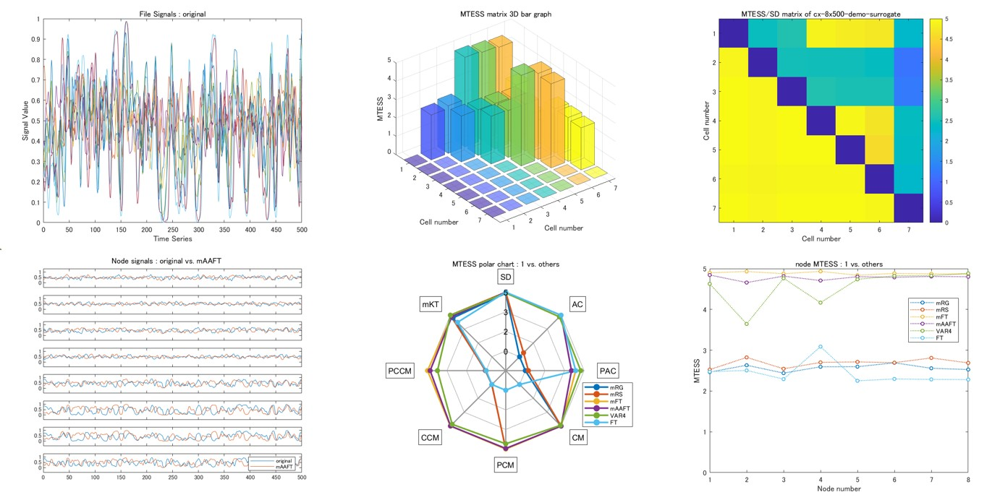
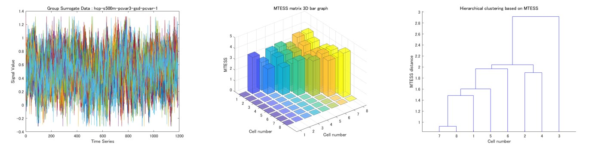

# GSDGM and MTESS Toolbox
Group Surrogate Data Generating Model (GSDGM) and Multivariate Time-series Ensemble Similarity Score (MTESS) Toolbox

## Introduction
The GSDGM and MTESS Toolbox is a powerful tool for surrogate data generation and multivariate time-series similarity analysis.
Three GSDGM algorithms have been implemented to generate group surrogate data: 1) Vector Auto-Regression (VAR) surrogate [(R. Liégeois, et al., 2017)](https://www.sciencedirect.com/science/article/abs/pii/S1053811917307516), 2) Principal Component VAR (PCVAR) surrogate, and 3) Vector Auto-Regressive Deep Neural Network (VARDNN) surrogate [(T.Okuno and A.Woodward, 2021)](https://www.frontiersin.org/articles/10.3389/fnins.2021.764796/full).
The VAR, PCVAR and VARDNN surrogates all try to fit the common features of the whole data. Thus, the GSDGM approach has the very unique ability to generate group centroid multivariate time-series.
This allows us to achieve the most biologically plausible standardized human brain dynamics model based on a large human rs-fMRI dataset from [the Human Connectome Project](https://www.humanconnectome.org/).

MTESS can quantify the similarity between two multivariate time-series. It is composed of the normalized distance or cos-similarity of seven basic statistical properties. These are the mean, standard deviation, auto-correlation, correlation matrix, partial correlation matrix, cross-correlation matrix, and partial cross-correlation matrix. By considering each of these statistical properties, it is possible to identify which of them differ between two multivariate time-series using a “MTESS radar chart.”  The total difference between two multivariate time-series is expressed by a single value [0, 5] (0: not similar to 5: similar)(MTESS), and the  difference in each univariate time-series, which we consider as nodes of a network, is expressed as a Node MTESS value.

The combination of GSDGM and MTESS allows us to perform individuality analysis of a group of multivariate time-series.
The GSDGM can generate the group centroid time-series and MTESS can quantify normality and abnormality based on a comparison between the group centroid and each individual multivariate time-series.

<b>Command line tools</b>

| name | description |
|:---|:---|
| mtess | Calculate and plot MTESS for a group of multivariate time-series data. |
| gsdgm | Generate a group surrogate model (VAR, PCVAR, VARDNN surrogate) and (multivariate time-series) group surrogate data.|
| surrogate | Generate univariate and multivariate time-series surrogate data by Random Gaussian (RG), Random shuffling (RS), Fourier Transfor (FT), Amplitude Adjusted FT (AAFT)[(J.Theilear et al., 1992)](https://www.sciencedirect.com/science/article/abs/pii/016727899290102S), Iterated AAFT (IAAFT)[(T.Schreiber and A.Schmitz, 1996)](https://journals.aps.org/prl/abstract/10.1103/PhysRevLett.77.635), VAR, PCVAR, VARDNN surrogate.|
| surrotest | Hypothesis testing based on the monte-carlo method (Linearity test, Gaussian distribution test, Independent and Identically Distributed (I.I.D) test)  [(J.Theilear and D.Prichard, 1996)](https://www.sciencedirect.com/science/article/abs/pii/0167278996000504).|
| nii2roisig | Extract fMRI ROI time-series data from NIfTI files (.nii, .nii.gz) with the ROI atlas file (.nii, .nii.gz). |

## Requirements: Software
* MATLAB R2019b or later
* Deep Learning Toolbox ver12.1 or later
* Fuzzy Logic Toolbox ver2.6 or later
* Parallel Computing Toolbox ver7.1 or later
* [VARDNN Toolbox](https://github.com/takuto-okuno-riken/vardnn)

Please download the [VARDNN Toolbox](https://github.com/takuto-okuno-riken/vardnn) and "Add Path" in the MATLAB before using GSDGM and MTESS Toolbox.

## Installation
1. Download this Toolbox and [VARDNN Toolbox](https://github.com/takuto-okuno-riken/vardnn) zip files.
2. Extract zip files under your working directory <work_path>.
3. Run the MATLAB software, and "Add Path" extracted directories (i.e. <work_path/vardnn-master> and <work_path/mtess-master>).
4. Move to <work_path/mtess-master> directory and run the following demos.

## Command Line Tools Demos
<b>Demo 1</b> 
The first demo shows the calculation of MTESS among time-series data and figure output. 
(Copy and paste this command line. Demo data is included in GSDGM and MTESS Toolbox.)
~~~
>> mtess --showinsig --showmat --showsig --showprop --shownode data/cx-8x500-demo-surrogate.mat 
...
output mat file : results/cx-8x500-demo-surrogate_mtess.mat
~~~

This demo calculates MTESS and generates the following figures:

"--showinsig" option shows each multivariate time-series data. 
"--showmat" option shows MTESS matrix and statistical property matrix results. 
"--showsig" option shows comparison time-series plot between first data vs. others. 
"--showprop" option shows MTESS Polar chart result of first data vs. others. 
"--shownode" option shows Node MTESS result of first data vs. others. 
 
Finally, the "mtess" command saves the calculation result in either .mat or .csv format ("--format 0" option).

##
<b>Demo 2</b> 
The second demo shows the calculation of surrogate data, then the calculation of MTESS between original time-series data vs. surrogate data.
~~~
>> surrogate -s -f -a -v data/demo-original-8x500.csv
surrogate sample : 1
output mat file : results/demo-original-8x500_var_multi_all.mat
output mat file : results/demo-original-8x500_rs_multi_all.mat
output mat file : results/demo-original-8x500_ft_multi_all.mat
output mat file : results/demo-original-8x500_aaft_multi_all.mat
>> mtess --showmat --showprop --showsig data/demo-original-8x500.csv results/demo-original-8x500_rs_multi_all.mat results/demo-original-8x500_var_multi_all.mat results/demo-original-8x500_ft_multi_all.mat results/demo-original-8x500_aaft_multi_all.mat
...
output mat file : results/demo-original-8x500_mtess.mat
~~~
the "surrogate" command reads a single multivariate time-series (8x500) file and generates surrogate data (8x500) by (multivariate) RS surrogate, VAR surrogate, FT surrogate, and AAFT surrogate.
Then, the "mtess" command reads the original time-series .csv and surrogate time-series data .mat files, and calculates multivariate time-series similarity.

As can be seen in this result, VAR, FT and AAFT surrogate data (cell number 3-5) vs. original time-series data (cell number 1) shows a higher MTESS (similarity) than RS surrogate data (cell number 2) vs. original data.

##
<b>Demo 3</b> 
The third demo shows the calculation of (VAR) group surrogate data based on [the Human Connectome Project](https://www.humanconnectome.org/) S500 male rs-fMRI data (132 ROIs). Then MTESS is calculated amongst some samples of rs-fMRI time-series data and group surrogate data. 
(Caution: Downloading and MTESS calculation will take some time.)
~~~
>> gsdgm --surrnum 2 --showsig http://fmridata.s223.xrea.com/hcp-s500m-var1.mat
downloading http://fmridata.s223.xrea.com/hcp-s500m-var1.mat ...
save cache file : data/cache/fmridata_s223_xrea_com-hcp-s500m-var1.mat
surrogate sample : 1
surrogate sample : 2
output mat file : results/fmridata_s223_xrea_com-hcp-s500m-var1_gsd_var.mat
>> mtess --showmat --showforce --showdend ward --showprop --cache data/demo-fmri-132x1190s.mat results/fmridata_s223_xrea_com-hcp-s500m-var1_gsd_var.mat
...
output mat file : results/demo-fmri-132x1190s_mtess.mat
~~~

As can be seen in this result, the VAR group surrogate data (cell number 7,8) shows a higher MTESS than the sample rs-fMRI data (cell number 1-6).
This is because the downloaded data generating model (GSDGM) was created using a large set of HCP data (N=410) and can thus generate group representative (standard) human brain dynamics. This generated group surrogate data can be considered as the centroid of the group of original rs-fMRI time-series data.

Other GSDGM .mat files (male, female, algorithms) can be found in [Zenodo](https://zenodo.org/record/6381103).

##
<b>Demo 4</b> 
This demo shows creation of a data generating model (GSDGM) from sample rs-fMRI time-series data (132 ROIs). Then MTESS is calculated amongst the group of original time-series data and group surrogate data. 
(Caution: MTESS calculation will take a time.)
~~~
>> gsdgm -v --lag 1 --surrnum 2 --showsig --showras data/demo-fmri-132x1190s.mat
output group surrogate model file : results/demo-fmri-132x1190s_gsm_var.mat
surrogate sample : 1
surrogate sample : 2
output mat file : results/demo-fmri-132x1190s_gsd_var.mat
>> mtess --showmat --showprop --showdend ward --cache --showforce data/demo-fmri-132x1190s.mat results/demo-fmri-132x1190s_gsd_var.mat
...
save cache of demo-fmri-132x1190s-gsd-var-1
save cache of demo-fmri-132x1190s-gsd-var-2
output mat file : results/demo-fmri-132x1190s_mtess.mat
~~~

As can be seen in this result, VAR group surrogate data (cell number 7,8) shows a higher MTESS than the original data (cell number 1-6).
From hierarchical clustering and force weight effect graph visualization it can be seen that the group surrogate data is the representative centroid of the group of original time-series data.

##
<b>Demo 5</b> 

Linearity test: 
1. Use FT or AAFT surrogate ("surrogate -f" or "-a" command) to generate 399 surrogate data samples from the original time-series file.
2. Use the "-l" option of the "surrotest" command for carrying out a linearity test. The original time-series and surrogate data files must be specified for this command.
~~~
>> surrogate -f --surrnum 399 data/demo-original-8x500.csv
output mat file : results/demo-original-8x500_ft_multi_all.mat
>> surrotest -l --showsig --showrank data/demo-original-8x500.csv results/demo-original-8x500_ft_multi_all.mat
significantly not linear (1 / 8)
output mat file : results/demo-original-8x500_linear_test.mat
~~~
The plot design for the linearity test was inspired by [J.Theilear and D.Prichard (1996)](https://www.sciencedirect.com/science/article/abs/pii/0167278996000504).

Gaussian distribution test: 
1. Use RG surrogate ("surrogate -g" command) to generate 399 of surrogate data samples from the original time-series file.
2. Use the "-g" option of the "surrotest" command for Gaussian distribution test. The original time-series and surrogate data files must be specified for this command.
~~~
>> surrogate -g --surrnum 399 data/demo-original-8x500.csv
output mat file : results/demo-original-8x500_rg_multi_all.mat
>> surrotest -g --showsig --showrank data/demo-original-8x500.csv results/demo-original-8x500_rg_multi_all.mat
significantly not gaussian (5 / 8)
output mat file : results/demo-original-8x500_gaussian_test.mat
~~~

Independent and Identically Distributed (I.I.D) test: 
1. Use RS surrogate ("surrogate -s" command) to generate 399 of surrogate data samples from the original time-series file.
2. Use the "-i" option of the "surrotest" command for I.I.D test. The original time-series and surrogate data files must be specified for this command.
~~~
>> surrogate -s --surrnum 399 data/demo-original-8x500.csv
output mat file : results/demo-original-8x500_rs_multi_all.mat
>> surrotest -i --showsig --showrank data/demo-original-8x500.csv results/demo-original-8x500_rs_multi_all.mat
significantly not I.I.D (8 / 8)
output mat file : results/demo-original-8x500_iid_test.mat
~~~

##
<b>Demo 6</b> 
This demo shows the extraction of rs-fMRI time-series data (132 ROIs). Then MTESS is calculated amongst the group of rs-fMRI ROI time-series data. 
(Caution: Data for this demo is not included in the toolbox.)
~~~
>> nii2roisig -a D:/work/conn/rois/atlas.nii --showsig --transform 1 *_rfMRI_REST1_LR.nii.gz
checking atlas space size ...
...
processing : 101309_rfMRI_REST1_LR
output mat file : results/100307_rfMRI_REST1_LR_all.mat
>> mtess --showmat --showforce --showdend ward --showprop results/100307_rfMRI_REST1_LR_all.mat
...
output mat file : results/100307_rfMRI_REST1_LR_all_mtess.mat
~~~

As can be seen in this result, rs-fMRI ROI time-series data are extracted from a pre-processed nifti file (MNI space) with CONN atlas data.
Then, the multivariate time-series similarity among subjects are calculated and analysed by the "mtess" command.

## Command Line Tools Reference
<b>mtess command</b> 
~~~
>> mtess -h
usage: mtess [options] file1.mat file2.mat ...
  --range type        input group value range (default:"auto", sigma:<num>, full:<num> or <min>:<max>)
  --ndft num          DFT sampling <number> (even number) (default: 100)
  --pcc type          Partial Cross-Correlation algorithm 0:auto, 1:PCC, 2:SV-PCC, 3:PC-PCC (dafault:0)
  --cclag num         time lag <num> for Cross Correlation (default:8)
  --pcclag num        time lag <num> for Partial Cross Correlation (default:8)
  --outpath path      output files <path> (default:"results")
  --format type       save file format <type> 0:csv, 1:mat (default:1)
  --transform type    input signal transform <type> 0:raw, 1:sigmoid (default:0)
  --transopt num      signal transform option <num> (for type 1:centroid value)
  --showinsig         show input time-series data of <filename>.csv
  --showinras         show raster plot of input time-series data of <filename>.csv
  --showmat           show result MTESS matrix
  --showsig           show 1 vs. others node signals
  --showprop          show result polar chart of 1 vs. others MTESS statistical properties
  --shownode          show result line plot of 1 vs. others node MTESS
  --showdend algo     show dendrogram of <algo> hierarchical clustering based on MTESS matrix. see MATLAB linkage method option.
  --showforce         show force weight effect graph based on MTESS matrix
  --cache             use cache file for MTESS calculation (low memory mode)
  --cachepath path    cache files <path> (default:"results/cache")
  -v, --version       show version number
  -h, --help          show command line help
~~~
The input .mat file should include input cell data. The node count must be the same within the group, whereas time-series length does not have to be the same.
| name | cell | description |
|:---|:---|:---|
|CX |{&lt;nodes&gt; x &lt;length&gt;} x &lt;cell number&gt; |group of multivariate time-series|
|names |{'data name string'} x &lt;cell number&gt; |names of each time-series data|

The output .mat file includes the following matrix data:

| name | matrix | description |
|:---|:---|:---|
|MTS |&lt;cell number&gt; x &lt;cell number&gt; | MTESS matrix (2D)|
|MTSp |&lt;cell number&gt; x &lt;cell number&gt; x 7| MTESS statistical property matrix (3D)|
|nMTS |&lt;cell number&gt; x &lt;cell number&gt; x &lt;nodes&gt;| Node MTESS matrix (3D)|
|nMTSp |&lt;cell number&gt; x &lt;cell number&gt; x &lt;nodes&gt; x 7| Node MTESS statistical property matrix (4D)|

Similarities are generated for the following 7 statistical properties: mean, standard deviation, DFT amplitude, correlation, partial correlation, cross-correlation and partial cross-correlation.

##
<b>gsdgm command</b> 
~~~
>> gsdgm -h
model training : gsdgm [options] file1.mat file2.mat ...
surrogate data : gsdgm [options] file_gsm_<type>.mat
  -v, --var           output Vector Auto-Regression (VAR) group surrogate model (<filename>_gsm_var.mat)
  -p, --pcvar         output Principal Component VAR (PCVAR) group surrogate model (<filename>_gsm_pcvar.mat)
  -d, --vardnn        output VAR Deep Neural Network (VARDNN) group surrogate model (<filename>_gsm_vardnn.mat)
  --lag num           time lag <num> for VAR, PCVAR, VARDNN surrogate model (default:3)
  --noise type        noise type for VAR, PCVAR, VARDNN surrogate model (default:"gaussian" or "residuals")
  --outpath path      output files <path> (default:"results")
  --transform type    input training signal transform <type> 0:raw, 1:sigmoid (default:0)
  --transopt num      signal transform option <num> (for type 1:centroid value)
  --format type       output surrogate data file format <type> 0:csv, 1:mat (default:1)
  --surrnum num       output surrogate sample number <num> (default:1)
  --siglen num        output time-series length <num> (default:same as input time-series)
  --range type        output surrogate value range (default:"auto", sigma:<num>, full:<num>, <min>:<max> or "none")
  --pcrate num        principal component variance rate <num> for PCVAR surrogate (default:0.99)
  --epoch num         VARDNN surrogate training epoch number <num> (default:1000)
  --showinsig         show input time-series data of <filename>.csv
  --showinras         show raster plot of input time-series data of <filename>.csv
  --showsig           show output surrogate time-series data
  --showras           show raster plot of output surrogate time-series data
  --version           show version number
  -h, --help          show command line help
~~~
The input .mat file should include input cell data described as follows. The node count must be the same within the group, whereas the time-series length does not have to be the same.
| name | cell | description |
|:---|:---|:---|
|CX |{&lt;nodes&gt; x &lt;length&gt;} x &lt;cell number&gt; |group of multivariate time-series|
|names |{'data name string'} x &lt;cell number&gt; |names of each time-series data|

The output (group surrogate model) .mat file includes the following struct data:

| name | type | description |
|:---|:---|:---|
|net | struct |struct of group surrogate model|
|gRange | struct |struct of group range information|
|name | string |name of group surrogate model|

The output (group surrogate data) .mat file includes the following cell data:

| name | cell | description |
|:---|:---|:---|
|CX |{&lt;nodes&gt; x &lt;length&gt;} x &lt;cell number&gt; |group of multivariate time-series|
|names |{'data name string'} x &lt;cell number&gt; |names of each time-series data|

##
<b>surrogate command</b> 
~~~
>> surrogate -h
usage: surrogate [options] filename.csv ...
  -g, --rg            output Random Gaussian (RG) surrogate (<filename>_rg_<variate>_<num>.csv)
  -s, --rs            output Random Shuffling (RS) surrogate (<filename>_rs_<variate>_<num>.csv)
  -f, --ft            output Fourier Transform (FT) surrogate (<filename>_ft_<variate>_<num>.csv)
  -a, --aaft          output Amplitude Adjusted FT (AAFT) surrogate (<filename>_aaft_<variate>_<num>.csv)
  -i, --iaaft         output Iterated AAFT (IAAFT) surrogate (<filename>_iaaft_<variate>_<num>.csv)
  -v, --var           output Vector Auto-Regression (VAR) surrogate (<filename>_var_<variate>_<num>.csv)
  -p, --pcvar         output Principal Component VAR (PCVAR) surrogate (<filename>_pcvar_<variate>_<num>.csv)
  -d, --vardnn        output VAR Deep Neural Network (VARDNN) surrogate (<filename>_vardnn_<variate>_<num>.csv)
  -l, --lazy          output Lazy Learning (LL) surrogate (<filename>_lazy_<variate>_<num>.csv)
  --multi             output multivariate surrogate (default:on)
  --uni               output univariate surrogate (default:off)
  --noise type        noise type for VAR, PCVAR, VARDNN, LL surrogate (default:"gaussian")
  --surrnum num       output surrogate sample number <num> (default:1)
  --outpath path      output files <path> (default:"results")
  --format type       save file format <type> 0:csv, 1:mat(each), 2:mat(all) (default:2)
  --transform type    input signal transform <type> 0:raw, 1:sigmoid (default:0)
  --transopt num      signal transform option <num> (for type 1:centroid value)
  --lag num           time lag <num> for VAR, PCVAR, VARDNN, LL (default:3)
  --epoch num         VARDNN training epoch number <num> (default:1000)
  --l2 num            VARDNN training L2Regularization <num> (default:0.05)
  --nn num            <num>-nearest neighbor for Lazy Learning (default:2)
  --showsig           show input time-series data of <filename>.csv
  --nocache           do not use cache file for VARDNN training
  --version           show version number
  -h, --help          show command line help
~~~
The input .csv or .mat file should include time-series matrix data in the following format:
| name | matrix | description |
|:---|:---|:---|
|X |&lt;nodes&gt; x &lt;length&gt; | multivariate time-series|

The output (surrogate data) .mat file includes the following cell data:

| name | cell | description |
|:---|:---|:---|
|CX |{&lt;nodes&gt; x &lt;length&gt;} x &lt;cell number&gt; |group of multivariate time-series|
|names |{'data name string'} x &lt;cell number&gt; |names of each time-series data|

##
<b>surrotest command</b> 
~~~
>> surrotest -h
usage: surrotest [options] <original>.csv surrogate.mat ...
  -g, --gaussian      output Gaussian distribution test (<original>_gauss_test.csv)
  -l, --linear        output Linearity test  (<original>_linear_test.csv)
  -i, --iid           output I.I.D test (<original>_iid_test.csv)
  --side num          bottom-side(1), both-side(2), top-side(3) (default:2)
  --outpath path      output files <path> (default:"results")
  --format type       save file format <type> 0:csv, 1:mat (default:1)
  --showsig           show input time-series data of <original>.csv
  --showrank          show rank result of <original>.csv
  -v, --version       show version number
  -h, --help          show command line help
~~~
The input .mat file should include input cell data described as follows. The node count must be the same within the group.
| name | cell | description |
|:---|:---|:---|
|CX |{&lt;nodes&gt; x &lt;length&gt;} x &lt;cell number&gt; |group of multivariate time-series|
|names |{'data name string'} x &lt;cell number&gt; |names of each time-series data|

The output .mat file includes the following matrix data:

| name | matrix | description |
|:---|:---|:---|
|P |&lt;nodes&gt; x 1 | P-value result|
|Rank |&lt;nodes&gt; x 1 | Rank value result |

##
<b>nii2roisig command</b> 
~~~
>> nii2roisig -h
usage: nii2roisig [options] -a atlas.nii file1.nii ...
  -a, --atlas file    ROI atlas nifti <file>
  --outpath path      output files <path> (default:"results")
  --format type       save file format <type> 0:csv, 1:mat(each), 2:mat(all) (default:2)
  --transform type    output signal transform <type> 0:raw, 1:sigmoid (default:0)
  --transopt num      signal transform option <num> (for type 1:centroid value)
  --showsig           show output time-series data of <original>.csv
  --showras           show raster plot of output time-series data of <original>.csv
  --nocache           do not use cache file for conversion
  -v, --version       show version number
  -h, --help          show command line help
~~~
Inputs are a ROI atlas .nii (.nii.gz) and rs-fMRI .nii (.nii.gz) files. Both files should have data in the same physical space (i.e. MNI space).

The output .mat file includes the following cell data:

| name | cell | description |
|:---|:---|:---|
|CX |{&lt;nodes&gt; x &lt;length&gt;} x &lt;cell number&gt; |group of multivariate time-series|
|names |{'data name string'} x &lt;cell number&gt; |names of each time-series data|

## Citing GSDGM and MTESS Toolbox
If you find GSDGM and MTESS Toolbox useful in your research, please cite it as follows: 

Takuto Okuno, Junichi Hata, Yawara Haga, Kanako Muta, Hiromichi Tsukada, Ken Nakae, Hideyuki Okano, Alexander Woodward,
["Group Surrogate Data Generating Models and Similarity Quantifiation of Multivariate Time-Series: A Resting-State fMRI Study"](https://www.yahoo.com/), work in progress.

