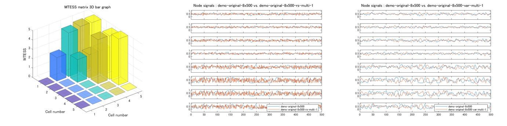

# GSDGM and MTESS toolbox
Group Surrogate Data Generating Model (GSDGM) and Multivariate Time-series Ensemble Similarity Score (MTESS) toolbox

## Introduction
"GSDGM and MTESS toolbox" is a powerful tool for surrogate data generation and multivariate time-series similarity analysis.
Three GSDGM algorithms, such as Vector Auto-Regression (VAR) surrogate, Principal Component VAR (PCVAR) and Vector Auto-Regressive Deep Neural Network (VARDNN)[(T.Okuno and A.Woodward, 2021)](https://www.frontiersin.org/articles/10.3389/fnins.2021.764796/full) are implemented in this toolbox to generate group surrogate data.
VAR surrogate obediently tried to fit the whole data, Otherwise PCVAR and VARDNN surrogate tried to fit the common ingredients of the whole data. 
Thus, PCVAR and VARDNN surrogate shows very unique tendency to generate group centroid multivariate time-series.
This allows us to have the most biologically plausible standardized human brain dynamics model based on a large human rs-fMRI dataset of [the Human Connectome Project](https://www.humanconnectome.org/).

MTESS can quantify similarity between two multivariate time-series.
It is consisted by normalized distance and cos-similarity of seven basic statistical properties, such as mean, standard deviation, auto-covariance, covariance matrix, partial covariance matrix, cross-covariance matrix and partial cross-covariance matrix.
Therefore, you can identify which statistical property is different between two multivariate time-series by MTESS radar chart.
Total difference between two multivariate time-series is expressed by single value (MTESS), and each node difference is also expressed (Node MTESS).

<b>Command line tools</b>

| name | description |
|:---|:---|
| mtess | Calculating and plotting MTESS from group of multivariate time-series data. |
| gsdgm | Generating group surrogate model (VAR, PCVAR, VARDNN surrogate) and (multivariate time-series) group surrogate data.|
| surrogate | Generating univariate and multivariate time-series surrogate data by Random Gaussian (RG), Random shuffling (RS), Fourier Transfor (FT), Amplitude Adjusted FT (AAFT)[(J.Theilear et al., 1992)](https://www.sciencedirect.com/science/article/abs/pii/016727899290102S), Iterated AAFT (IAAFT)[(T.Schreiber and A.Schmitz, 1996)](https://journals.aps.org/prl/abstract/10.1103/PhysRevLett.77.635), VAR, PCVAR, VARDNN surrogate.|
| surrotest | Hypothesis testing based on monte-carlo method (Linearity test, Gaussian distribution test, Independent and Identically Distributed (I.I.D) test)  [(J.Theilear and D.Prichard, 1996)](https://www.sciencedirect.com/science/article/abs/pii/0167278996000504).|
| nii2roisig | Extract fMRI ROI time-series data from nifti files (.nii, .nii.gz) with the ROI atlas file (.nii, .nii.gz). |

## Requirements: software
* MATLAB R2019b or later
* Deep Learning Toolbox ver12.1 or later
* Fuzzy Logic Toolbox ver2.6 or later
* Parallel Computing Toolbox ver7.1 or later
* [VARDNN Toolbox](https://github.com/takuto-okuno-riken/vardnn)

Please download [VARDNN Toolbox](https://github.com/takuto-okuno-riken/vardnn) and "Add Path" in the MATLAB before using GSDGM and MTESS toolbox.

## Command line tools Demo
<b>Demo1</b> 
First demo shows calculation of MTESS among time-series data and figure output. 
(Copy and paste this command line. Demo data is included in GSDGM and MTESS toolbox.)
~~~
>> mtess --showinsig --showmat --showsig --showprop --shownode data/cx-8x500-demo-surrogate.mat 
...
output mat file : results/cx-8x500-demo-surrogate_mtess.mat
~~~

This demo calculates MTESS and shows following figures:

"--showinsig" option shows each multivariate time-series data. 
"--showmat" option shows MTESS matrix and statistical property matrix results. 
"--showsig" option shows comparison time-series plot between first data vs. others. 
"--showprop" option shows MTESS Polar chart result of first data vs. others. 
"--shownode" option shows Node MTESS result of first data vs. others. 
 
Finally, mtess command saves calculation result with .mat or .csv ("--format 0" option).

##
<b>Demo2</b> 
Second demo shows calculation of surrogate data, then calculation of MTESS between original time-series data vs. surrogate data.
~~~
>> surrogate -s -f -a -v data/demo-original-8x500.csv
surrogate sample : 1
output mat file : results/demo-original-8x500_var_multi_all.mat
output mat file : results/demo-original-8x500_rs_multi_all.mat
output mat file : results/demo-original-8x500_ft_multi_all.mat
output mat file : results/demo-original-8x500_aaft_multi_all.mat
>> mtess --showmat --showprop --showsig data/demo-original-8x500.csv results/demo-original-8x500_rs_multi_all.mat results/demo-original-8x500_var_multi_all.mat results/demo-original-8x500_ft_multi_all.mat results/demo-original-8x500_aaft_multi_all.mat
...
output mat file : results/demo-original-8x500_mtess.mat
~~~
"surrogate" command reads single multivariate time-series (8x500) file and generates surrogate data (8x500) by (multivariate) RS surrogate, VAR surrogate, FT surrogate and AAFT surrogate.
Then, "mtess" command reads original time-series .csv and surrogate time-series data .mat files, and calculates multivariate time-series similarity.

As you see in this result, VAR, FT and AAFT surrogate data (cell number 3-5) vs. original time-series data (cell number 1) shows higher MTESS (similarity) than RS surrogate data (cell number 2) vs. original data.

##
<b>Demo3</b> 
Third demo shows calculation of (PCVAR) group surrogate data based on [the Human Connectome Project](https://www.humanconnectome.org/) S500 male rs-fMRI data (132 ROIs). Then calculation of MTESS among some samples of rs-fMRI time-series data and group surrogate data. 
(Caution: Downloading and MTESS calculation will take a time.)
~~~
>> gsdgm --surrnum 2 --showsig http://fmridata.s223.xrea.com/hcp-s500m-pcvar3.mat
downloading http://fmridata.s223.xrea.com/hcp-s500m-pcvar3.mat ...
save cache file : data/cache/fmridata_s223_xrea_com-hcp-s500m-pcvar3.mat
surrogate sample : 1
surrogate sample : 2
output mat file : results/hcp-s500m-pcvar3_gsd_pcvar.mat
>> mtess --showmat --showforce --showdend ward --showprop data/demo-fmri-132x1190s.mat results/hcp-s500m-pcvar3_gsd_pcvar.mat
...
output mat file : results/demo-fmri-132x1190s_mtess.mat
~~~

As you see in this result, PCVAR group surrogate data (cell number 7,8) shows higher MTESS than sample rs-fMRI data (cell number 1-6).
Because downloaded data generating model (GSDGM) is created by large HCP data (N=410) and so it can generate group representative (standard) human brain dynamics.
Generated group surrogate data will be the representative and centroid of the group of original rs-fMRI time-series data.

Other GSDGM .mat files (male, female, algorithms) can be found in [Zenodo](https://sandbox.zenodo.org/record/1040399).

##
<b>Demo4</b> 
This demo shows creation of the data generating model (GSDGM) from sample rs-fMRI time-series data (132 ROIs). Then calculation of MTESS among group of original time-series data and group surrogate data. 
(Caution: MTESS calculation will take a time.)
~~~
>> gsdgm -v --lag 1 --surrnum 2 --showsig --showras data/demo-fmri-132x1190s.mat
output group surrogate model file : results/demo-fmri-132x1190s_gsm_var.mat
surrogate sample : 1
surrogate sample : 2
output mat file : results/demo-fmri-132x1190s_gsd_var.mat
>> mtess --showmat --showprop --showdend ward --showforce data/demo-fmri-132x1190s.mat results/demo-fmri-132x1190s_gsd_var.mat
...
save cache of demo-fmri-132x1190s-gsd-var-1
save cache of demo-fmri-132x1190s-gsd-var-2
output mat file : results/demo-fmri-132x1190s_mtess.mat
~~~

As you see in this result, VAR group surrogate data (cell number 7,8) shows higher MTESS than original data (cell number 1-6).
Based on hierarchical clustering and force weight effect graph, group surrogate data will be the representative and centroid of the group of original time-series data.

##
<b>Demo5</b> 

Linearity test 
1. Use FT or AAFT surrogate ("surrogate -f" or "-a" command) to generate 399 of surrogate data from original time-series file.
2. Use "-l" option of "surrotest" command for linearity test. Original time-series file and surrogate data file are specified this command.
~~~
>> surrogate -f --surrnum 399 data/demo-original-8x500.csv
output mat file : results/demo-original-8x500_ft_multi_all.mat
>> surrotest -l --showsig --showrank data/demo-original-8x500.csv results/demo-original-8x500_ft_multi_all.mat
significantly not linear (1 / 8)
output mat file : results/demo-original-8x500_linear_test.mat
~~~
This plot design is inspired by [J.Theilear and D.Prichard (1996)](https://www.sciencedirect.com/science/article/abs/pii/0167278996000504).

Gaussian distribution test
1. Use RG surrogate ("surrogate -g" command) to generate 399 of surrogate data from original time-series file.
2. Use "-g" option of "surrotest" command for Gaussian distribution test. Original time-series file and surrogate data file are specified this command.
~~~
>> surrogate -g --surrnum 399 data/demo-original-8x500.csv
output mat file : results/demo-original-8x500_rg_multi_all.mat
>> surrotest -g --showsig --showrank data/demo-original-8x500.csv results/demo-original-8x500_rg_multi_all.mat
significantly not gaussian (5 / 8)
output mat file : results/demo-original-8x500_gaussian_test.mat
~~~

Independent and Identically Distributed (I.I.D) test
1. Use RS surrogate ("surrogate -s" command) to generate 399 of surrogate data from original time-series file.
2. Use "-i" option of "surrotest" command for I.I.D test. Original time-series file and surrogate data file are specified this command.
~~~
>> surrogate -s --surrnum 399 data/demo-original-8x500.csv
output mat file : results/demo-original-8x500_rs_multi_all.mat
>> surrotest -i --showsig --showrank data/demo-original-8x500.csv results/demo-original-8x500_rs_multi_all.mat
significantly not I.I.D (8 / 8)
output mat file : results/demo-original-8x500_iid_test.mat
~~~

##
<b>Demo6</b> 
This demo shows extraction of rs-fMRI time-series data (132 ROIs). Then calculation of MTESS among group of rs-fMRI ROI time-series data. 
(Caution: Data is not included in toolbox. This demo shows just sample use.)
~~~
>> nii2roisig -a D:/work/conn/rois/atlas.nii --showsig --transform 1 *_rfMRI_REST1_LR.nii.gz
checking atlas space size ...
...
processing : 101309_rfMRI_REST1_LR
output mat file : results/100307_rfMRI_REST1_LR_all.mat
>> mtess --showmat --showforce --showdend ward --showprop results/100307_rfMRI_REST1_LR_all.mat
...
output mat file : results/100307_rfMRI_REST1_LR_all_mtess.mat
~~~

As you see in this result, rs-fMRI ROI time-series data are extracted from pre-processed nifti file (MNI space) with CONN atlas data.
Then, multivariate time-series similarity among subjects are calculated and analysed by mtess command.

## Command line tools Reference
<b>mtess command</b> 
~~~
>> mtess -h
usage: mtess [options] file1.mat file2.mat ...
  --range n1:n2       value range [n1, n2] for normalized mean and std dev (default:min and max of input data)
  --ndft num          DFT sampling <number> (even number) (default: 100)
  --pcc type          Partial Cross-Correlation algorithm 0:auto, 1:PCC, 2:SV-PCC, 3:PC-PCC (dafault:0)
  --cclag num         time lag <num> for Cross Correlation (default:8)
  --pcclag num        time lag <num> for Partial Cross Correlation (default:8)
  --outpath path      output files <path> (default:"results")
  --format type       save file format <type> 0:csv, 1:mat (default:1)
  --transform type    input signal transform <type> 0:raw, 1:sigmoid (default:0)
  --transopt num      signal transform option <num> (for type 1:centroid value)
  --showinsig         show input time-series data of <filename>.csv
  --showinras         show raster plot of input time-series data of <filename>.csv
  --showmat           show result MTESS matrix
  --showsig           show 1 vs. others node signals
  --showprop          show result polar chart of 1 vs. others MTESS statistical properties
  --shownode          show result line plot of 1 vs. others node MTESS
  --showdend algo     show dendrogram of <algo> hierarchical clustering based on MTESS matrix. see MATLAB linkage method option.
  --showforce         show force weight effect graph based on MTESS matrix
  --nocache           do not use cache file for MTESS calculation
  -v, --version       show version number
  -h, --help          show command line help
~~~
Input .mat file should include input cell data. Node size must be the same within the group. Time-series length does not have to be the same.
| name | cell | description |
|:---|:---|:---|
|CX |{&lt;nodes&gt; x &lt;length&gt;} x &lt;cell number&gt; |group of multivariate time-series|
|names |{'data name string'} x &lt;cell number&gt; |names of each time-series data|

Output .mat file includes following matrix data.

| name | matrix | description |
|:---|:---|:---|
|MTS |&lt;cell number&gt; x &lt;cell number&gt; | MTESS matrix (2D)|
|MTSp |&lt;cell number&gt; x &lt;cell number&gt; x 7| MTESS statistical property matrix (3D)|
|nMTS |&lt;cell number&gt; x &lt;cell number&gt; x &lt;nodes&gt;| Node MTESS matrix (3D)|
|nMTSp |&lt;cell number&gt; x &lt;cell number&gt; x &lt;nodes&gt; x 7| Node MTESS statistical property matrix (4D)|

Similarities of 7 statistical properties are mean, standard deviation, DFT amplitude, correlation, partial correlation, cross-correlation and partial cross-correlation.

##
<b>gsdgm command</b> 
~~~
>> gsdgm -h
model training : gsdgm [options] file1.mat file2.mat ...
surrogate data : gsdgm [options] file_gsm_<type>.mat
  -v, --var           output Vector Auto-Regression (VAR) group surrogate model (<filename>_gsm_var.mat)
  -p, --pcvar         output Principal Component VAR (PCVAR) group surrogate model (<filename>_gsm_pcvar.mat)
  -d, --vardnn        output VAR Deep Neural Network (VARDNN) group surrogate model (<filename>_gsm_vardnn.mat)
  --lag num           time lag <num> for VAR, PCVAR, VARDNN surrogate model (default:3)
  --noise type        noise type for VAR, PCVAR, VARDNN surrogate model (default:"gaussian" or "residuals")
  --outpath path      output files <path> (default:"results")
  --transform type    input training signal transform <type> 0:raw, 1:sigmoid (default:0)
  --transopt num      signal transform option <num> (for type 1:centroid value)
  --format type       output surrogate data file format <type> 0:csv, 1:mat (default:1)
  --surrnum num       output surrogate sample number <num> (default:1)
  --siglen num        output time-series length <num> (default:same as input time-series)
  --pcrate num        principal component variance rate <num> for PCVAR surrogate (default:0.99)
  --epoch num         VARDNN surrogate training epoch number <num> (default:1000)
  --showinsig         show input time-series data of <filename>.csv
  --showinras         show raster plot of input time-series data of <filename>.csv
  --showsig           show output surrogate time-series data
  --showras           show raster plot of output surrogate time-series data
  --version           show version number
  -h, --help          show command line help
~~~
Input .mat file should include input cell data. Node size must be the same within the group. Time-series length does not have to be the same.
| name | cell | description |
|:---|:---|:---|
|CX |{&lt;nodes&gt; x &lt;length&gt;} x &lt;cell number&gt; |group of multivariate time-series|
|names |{'data name string'} x &lt;cell number&gt; |names of each time-series data|

Output (group surrogate model) .mat file includes following struct data.

| name | type | description |
|:---|:---|:---|
|net | struct |struct of group surrogate model|
|name | string |name of group surrogate model|

Output (group surrogate data) .mat file includes following cell data.

| name | cell | description |
|:---|:---|:---|
|CX |{&lt;nodes&gt; x &lt;length&gt;} x &lt;cell number&gt; |group of multivariate time-series|
|names |{'data name string'} x &lt;cell number&gt; |names of each time-series data|

##
<b>surrogate command</b> 
~~~
>> surrogate -h
usage: surrogate [options] filename.csv ...
  -g, --rg            output Random Gaussian (RG) surrogate (<filename>_rg_<variate>_<num>.csv)
  -s, --rs            output Random Shuffling (RS) surrogate (<filename>_rs_<variate>_<num>.csv)
  -f, --ft            output Fourier Transform (FT) surrogate (<filename>_ft_<variate>_<num>.csv)
  -a, --aaft          output Amplitude Adjusted FT (AAFT) surrogate (<filename>_aaft_<variate>_<num>.csv)
  -i, --iaaft         output Iterated AAFT (IAAFT) surrogate (<filename>_iaaft_<variate>_<num>.csv)
  -v, --var           output Vector Auto-Regression (VAR) surrogate (<filename>_var_<variate>_<num>.csv)
  -p, --pcvar         output Principal Component VAR (PCVAR) surrogate (<filename>_pcvar_<variate>_<num>.csv)
  -d, --vardnn        output VAR Deep Neural Network (VARDNN) surrogate (<filename>_vardnn_<variate>_<num>.csv)
  -l, --lazy          output Lazy Learning (LL) surrogate (<filename>_lazy_<variate>_<num>.csv)
  --multi             output multivariate surrogate (default:on)
  --uni               output univariate surrogate (default:off)
  --noise type        noise type for VAR, PCVAR, VARDNN, LL surrogate (default:"gaussian")
  --surrnum num       output surrogate sample number <num> (default:1)
  --outpath path      output files <path> (default:"results")
  --format type       save file format <type> 0:csv, 1:mat(each), 2:mat(all) (default:2)
  --transform type    input signal transform <type> 0:raw, 1:sigmoid (default:0)
  --transopt num      signal transform option <num> (for type 1:centroid value)
  --lag num           time lag <num> for VAR, PCVAR, VARDNN, LL (default:3)
  --epoch num         VARDNN training epoch number <num> (default:1000)
  --l2 num            VARDNN training L2Regularization <num> (default:0.05)
  --nn num            <num>-nearest neighbor for Lazy Learning (default:2)
  --showsig           show input time-series data of <filename>.csv
  --nocache           do not use cache file for VARDNN training
  --version           show version number
  -h, --help          show command line help
~~~
Input .csv or .mat file should include time-series matrix data.
| name | matrix | description |
|:---|:---|:---|
|X |&lt;nodes&gt; x &lt;length&gt; | multivariate time-series|

Output (surrogate data) .mat file includes following cell data.

| name | cell | description |
|:---|:---|:---|
|CX |{&lt;nodes&gt; x &lt;length&gt;} x &lt;cell number&gt; |group of multivariate time-series|
|names |{'data name string'} x &lt;cell number&gt; |names of each time-series data|

##
<b>surrotest command</b> 
~~~
>> surrotest -h
usage: surrotest [options] <original>.csv surrogate.mat ...
  -g, --gaussian      output Gaussian distribution test (<original>_gauss_test.csv)
  -l, --linear        output Linearity test  (<original>_linear_test.csv)
  -i, --iid           output I.I.D test (<original>_iid_test.csv)
  --side num          bottom-side(1), both-side(2), top-side(3) (default:2)
  --outpath path      output files <path> (default:"results")
  --format type       save file format <type> 0:csv, 1:mat (default:1)
  --showsig           show input time-series data of <original>.csv
  --showrank          show rank result of <original>.csv
  -v, --version       show version number
  -h, --help          show command line help
~~~
Input .mat file should include input cell data. Node size must be the same within the group.
| name | cell | description |
|:---|:---|:---|
|CX |{&lt;nodes&gt; x &lt;length&gt;} x &lt;cell number&gt; |group of multivariate time-series|
|names |{'data name string'} x &lt;cell number&gt; |names of each time-series data|

Output .mat file includes following matrix data.

| name | matrix | description |
|:---|:---|:---|
|P |&lt;nodes&gt; x 1 | P-value result|
|Rank |&lt;nodes&gt; x 1 | Rank value result |

##
<b>nii2roisig command</b> 
~~~
>> nii2roisig -h
usage: nii2roisig [options] -a atlas.nii file1.nii ...
  -a, --atlas file    ROI atlas nifti <file>
  --outpath path      output files <path> (default:"results")
  --format type       save file format <type> 0:csv, 1:mat(each), 2:mat(all) (default:2)
  --transform type    output signal transform <type> 0:raw, 1:sigmoid (default:0)
  --transopt num      signal transform option <num> (for type 1:centroid value)
  --showsig           show output time-series data of <original>.csv
  --showras           show raster plot of output time-series data of <original>.csv
  --nocache           do not use cache file for conversion
  -v, --version       show version number
  -h, --help          show command line help
~~~
Inputs are ROI atlas .nii (.nii.gz) and rs-fMRI .nii (.nii.gz) files. Both file should have same space (i.e. MNI space).

Output .mat file includes following cell data.

| name | cell | description |
|:---|:---|:---|
|CX |{&lt;nodes&gt; x &lt;length&gt;} x &lt;cell number&gt; |group of multivariate time-series|
|names |{'data name string'} x &lt;cell number&gt; |names of each time-series data|

## Citing GSDGM and MTESS toolbox
If you find GSDGM and MTESS toolbox useful in your research, please consider citing: 

Takuto Okuno, Junichi Hata, Hiromichi Tsukada, Ken Nakae, Hideyuki Okano, Alexander Woodward,
["Similarity quantification and group surrogate data generating models of multivariate time-series: a resting-state fMRI study"](https://www.yahoo.com/), work in progress.

